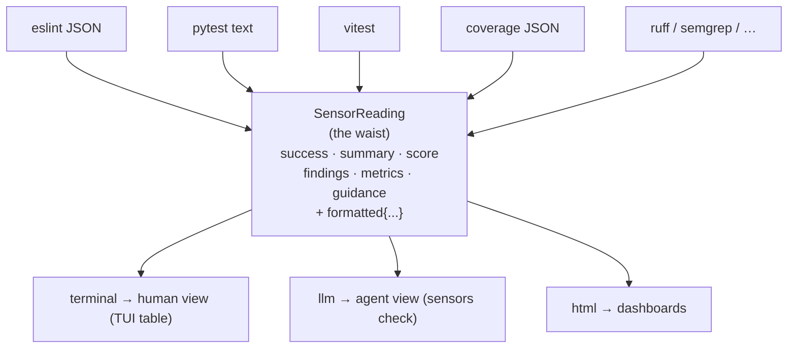
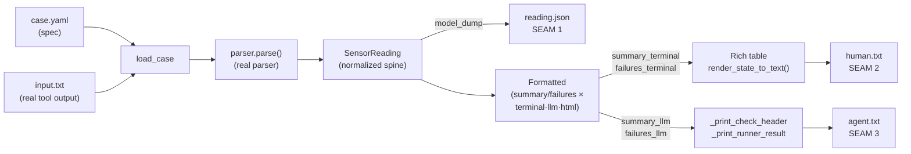
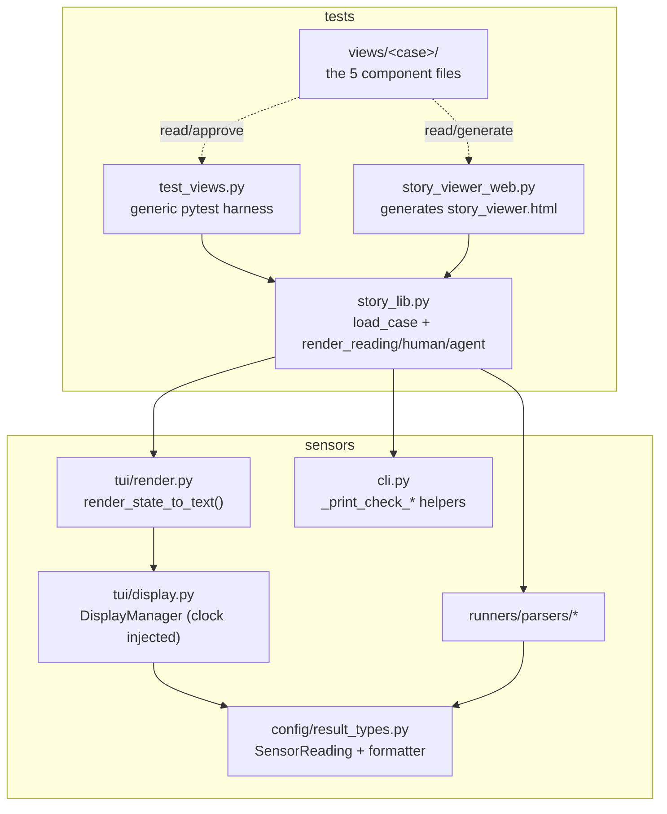

# Golden-view testing & story viewer

> Status: **walking skeleton working** (1 fixture, harness green, web viewer functional).
> Last updated: 2026-07-14. Pick-up notes at the bottom.

## 1. Why this exists

The two things the author actually wants to know about `sensors` are:

- **Is the sensor data displayed correctly in the human view?** (the live TUI table)
- **Is it displayed correctly in the agent view?** (`sensors check` output)

The inputs that drive those views are the **sensors** — each producing raw tool output
that a parser normalizes.

The design goal (from Ivett Ördög's "AI test desiderata") is tests that are:

1. about **what & why**, not *how* — no `assert result is truthy`;
2. **easy to validate at a glance** — you read the actual rendered output;
3. **hard to fake** — the only way to pass is to genuinely produce that output.

Generic AI-generated assertion tests fail all three. The approach here instead follows
Ivett's **constraint tests** (input/output file pairs + one generic harness) fused with
her **approved fixtures** (human-readable rendered state saved as a golden).

## 2. Core concept: a "story"

One test case = one folder under `tests/views/` = a **story** about one sensor
situation. Each story has up to **5 components** — 2 inputs, 3 outputs:

| Side | Component | Role | Seam |
|------|-----------|------|------|
| input | `case.yaml` | spec: which parser, frozen clock, per-runner timestamps | — |
| input | `<input>` (e.g. `input.txt`) | the **real captured tool output** the parser reads | — |
| output | `reading.json` | normalized `SensorReading` (findings, score, metrics) | 1 |
| output | `human.txt` | the human/terminal view, rendered **with ANSI color** | 2 |
| output | `agent.txt` | what `sensors check` prints for an agent | 3 |

The three outputs correspond to three **seams**, each of which can fail independently —
so when a golden diff goes red, *which file changed* tells you *which seam broke*.

## 3. How we found the seam (`SensorReading` is the waist)

Before designing any test, we mapped the app's real data flow — two parallel
explorations: one tracing the **human view** and **agent view** rendering paths, one
tracing the **sensor input** side (config → command → parser → normalized result) and
the existing tests.

The key finding: **`sensors` is an hourglass.** Upstream there are many heterogeneous
tools, each with its own output format (eslint JSON, pytest text, vitest, coverage
JSON, ruff, semgrep, stylelint, depcruise, …). Downstream there are a few view formats
(terminal, agent/LLM, HTML). In the middle, everything funnels through **one narrow
normalized type**:



This is *the* seam because it is the narrowest point that still touches everything the
author cares about ("is the data displayed correctly?"). The evidence in the code:

- Every parser implements `parse(output: str) -> SensorReading`
  (`sensors/runners/parsers/base.py`). That is the whole parser contract.
- `SensorReading.formatted` (a `Formatted`) is **pre-computed at write time** by a
  pydantic `model_validator` → `_build_formatted()` in
  `sensors/config/result_types.py`. It holds `summary` and `failures`, each in three
  styles: `*_terminal`, `*_llm`, `*_html`.
- The **human view** reads `formatted.summary_terminal` / `failures_terminal` into the
  Rich table (`sensors/tui/display.py`).
- The **agent view** reads `formatted.summary_llm` / `failures_llm`
  (`sensors/cli.py::_print_runner_result`).

So one object, produced by every parser and consumed by every renderer, is exactly
"2 inputs → 3 outputs": exercise the real parser once (**seam 1**) and the two real
renderers (**seams 2 & 3**) and you have covered the whole question — with no running
worker, no sockets, no live TUI.

**Seams we considered and rejected as the primary anchor:**

- *End-to-end subprocess* (`sensors check` / `sensors show`): most realistic, but
  non-deterministic (live timestamps), needs a running background worker + Unix sockets,
  is slow, and the TUI is interactive so its output isn't cleanly capturable. The
  process/socket *wiring* is already covered by `tests/test_e2e_cli.py`; re-testing it
  per fixture would add cost without testing rendering.
- *Unit asserts on parser internals*: too "how", brittle, and they don't answer the
  display question at all.

Anchoring on `SensorReading` and its two rendered projections gives the most coverage
per fixture while staying deterministic and glanceable — which is what made the
golden-view design possible.

## 4. The pipeline being tested



`SensorReading` (`sensors/config/result_types.py`) is the spine: every parser produces
one, and its `.formatted` block pre-computes the strings both views consume.

## 5. Module layout



Both the harness and the web viewer build stories through the **one** shared module
(`story_lib.py`), so they can never disagree about how a case is loaded or rendered.

## 6. The harness (`tests/test_views.py`)

One generic parametrized test walks every `tests/views/*/case.yaml`, renders the three
outputs through the **real** code, and diffs against the approved files.

```bash
# generate / update the approved goldens, then eyeball them:
SENSORS_APPROVE=1 uv run pytest tests/test_views.py
# normal run — asserts current output == approved:
uv run pytest tests/test_views.py
```

Adding a case never touches the harness: drop a folder with `case.yaml` + an input
file, run `--approve` once, review, commit.

## 7. The viewers

### Web viewer (`tests/story_viewer_web.py`)

```bash
uv run python -m tests.story_viewer_web          # writes tests/story_viewer.html
uv run python -m tests.story_viewer_web --open   # … and opens it in the browser
uv run python -m tests.story_viewer_web -o /tmp/viewer.html  # custom output path
```

Generates a **self-contained static HTML page** — open in any browser, no server
required. All story data is embedded as JSON; the page is fully offline-capable.

Layout: two-column overview — inputs left, **live-rendered** outputs right. Each output
panel is badged against its approved golden so the viewer doubles as a health dashboard.

```
┌─ INPUTS ─────────────────────┬─ OUTPUTS ────────────────────┐
│ spec    case.yaml             │ normalized reading  reading.json  ✓ approved │
│                               │                               │
│ captured tool output  input.txt│ human view   human.txt   ✓ approved │
│                               │                               │
│                               │ agent view   agent.txt   ✓ approved │
└───────────────────────────────┴───────────────────────────────┘
```

Rendering details:
- `case.yaml` / `reading.json` get **syntax highlighting** (YAML/JSON).
- `human.txt` is shown as its **real ANSI-colored** render — ANSI escape codes are
  converted to HTML `<span>` elements with matching CSS colours.
- `agent.txt` / raw `input.txt` rendered as plain pre-formatted text.

Badges: `✓ approved` (live == golden) · `✗ differs` · `⚠ not approved`.

Keyboard shortcuts: `←`/`p` and `→`/`n` switch between stories.

### Terminal viewer (`tests/story_viewer_tui.py`)

```bash
uv run python -m tests.story_viewer_tui
```

Interactive keyboard controls:
- `q`: quit
- `n` / `p` or `→` / `←`: next / previous story
- `Tab`: cycle focus through `sidebar`, `inputs`, `normalized reading`, `human view`, `agent view`
- `j` / `k` or `↓` / `↑`: move within focused pane (story list or scroll)
- `Enter`: open selected sidebar story
- `s`: toggle sidebar

The terminal viewer uses the same story payload as the web viewer and renders
`human.txt` with ANSI-aware terminal styling.
The outputs area is split into three independent panels (one per output), each
with its own scroll position.

## 8. Design decisions (and why)

- **Frozen clock via dependency injection, not an env var.** Relative times
  (`"2s ago"`, `Updated: … ago`) would make goldens flap. The agent view already
  threads `now` as a parameter. The human view's `DisplayManager._format_time_ago`
  reached for `datetime.now()`, so we added an injectable `clock` param to
  `DisplayManager` (defaults to the real UTC clock; tests pass `lambda: now`). No test
  hook leaks into production logic.
- **Human view golden = real terminal output with ANSI color.** `human.txt` is what a
  person actually sees, so you validate the real thing, not a proxy. Tradeoff: ANSI
  codes make git diffs slightly noisier; flip `styles=False` in `render_human` if that
  ever annoys. `render_state_to_text` uses a `StringIO`-backed recording console so the
  table is captured, **not** leaked to stdout.
- **`sensors/tui/render.py` is the "render state → text" seam.** The table-building
  code lives inside `DisplayManager`, welded to the live loop (raw-TTY, async polling,
  `Live`, keys). `render.py` lets us produce the table headlessly for the harness, the
  viewer, and any future non-interactive render. *Open question: keep it in `tui/`, fold
  it into a `DisplayManager.render_to_text()` method, or move under `tests/`.*
- **Hand-authored fixtures for now.** A `sensors capture` command (turn a live run into
  a fixture folder — Ivett's "copy the log into a file" move) was deferred.

## 9. Files touched

- **Modified** `sensors/tui/display.py` — injectable `clock` on `DisplayManager`;
  `_format_time_ago` now uses `self._clock()` and POSIX-timestamp comparison.
- **New** `sensors/tui/render.py` — `render_state_to_text(state, configs, *, clock, width, styles)`.
- **New** `tests/story_lib.py` — shared story loading + rendering.
- **New** `tests/test_views.py` — the generic golden harness.
- **New** `tests/story_viewer_web.py` — generates a self-contained `story_viewer.html`.
- **New** `tests/views/pytest-mixed/` — first fixture (real pytest output, 10 pass / 2 fail),
  seeded from `test-data/pytest-sample-output.txt`, with approved `reading.json` / `human.txt` / `agent.txt`.

## 10. Current status

- ✅ Harness green (`test_views.py`), existing `test_display.py` unaffected (28 passed).
- ✅ Web viewer (`story_viewer_web.py`) generates a self-contained `story_viewer.html`;
  syntax highlighting (YAML/JSON), ANSI→HTML colour conversion, and approved/differ
  badges all verified.
- ✅ stdout-leak bug in the renderer found and fixed.
- 🟡 Only **one** fixture so far — enough to prove the loop, not enough coverage.

## 11. Observation worth a decision

The current fixture already exposed something in the **pytest parser**: for a failure it
puts the *test name* in `Finding.file` (`"file": "test_divide_by_zero"`), leaves `line`
null, and buries the real `tests/test_calculator.py:23` inside the `message` blob. So the
agent view renders `test_divide_by_zero test_failure def test_divide_by_zero(): …`. That
may be intended, but it's exactly the "is that the right way to show a failure?" question
this system is meant to surface. **Not changed** — flagged for a decision.

## 12. Next steps (pick up here)

1. **Add fixtures** to cover more rendering paths (highest value first):
   - `eslint` case with real findings that have genuine `file:line:col` (exercises the
     location-rendering path the pytest case doesn't).
   - a **below-threshold** coverage case (`vitest_cov`/`pytest_cov` + `threshold`) —
     exercises the yellow `below_threshold` status and threshold recoloring.
   - a **snapshot/delta** case — exercises trend `🚀`/`🔺` and the `(-1)` delta in both views.
   - an all-green case (success path with empty failures).
   > Note: `load_case` currently derives status as success/failure only. For a
   > below-threshold fixture, either add `status: below_threshold` in `case.yaml`
   > (already supported via `r.get("status")`) or wire real threshold application.
2. **Multi-runner stories** — a `case.yaml` with several runners to see the full table
   with multiple rows (the human view is a table; one row under-tests it).
3. Decide the **`render.py` placement** question (§8).
4. Decide the **pytest parser `file` field** question (§11).
5. Optional: build **`sensors capture`** to generate fixtures from live runs.
6. Optional: snapshot-test the viewer's own frame (render to text at fixed size) so its
   layout doesn't regress.

## 13. Quick reference

```bash
SENSORS_APPROVE=1 uv run pytest tests/test_views.py   # (re)generate goldens
uv run pytest tests/test_views.py                     # verify against goldens
uv run python -m tests.story_viewer_web --open        # build + open the web viewer
uv run python -m tests.story_viewer_tui               # open the terminal viewer

# web viewer keys: ←/p  →/n  switch story
# terminal viewer keys: Tab  j/k  Enter  n/p  s  q
```
